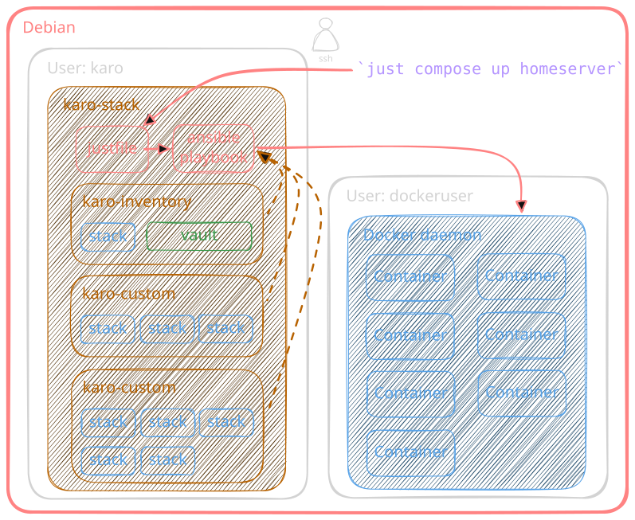

# karo-custom

A karo-custom repo is a user created collection
of templates for custom Docker Compose stacks.
Configurable and deployed like the rest of the karo-stack using Ansible.
While also designed to be optionally shareable,
for use by others on their own homeserver.

## Overview

Part of why the karo-stack was built was to better
enable users to share Docker Compose setups with one another.
Done by creating a standardised environment
(Debian server, Ansible playbook, rootless Docker, Traefik reverse proxy).
This commonality allows users to create compose files that are
compatible with any other homeserver running the karo-stack.

To setup a new service using Docker,
you'd previously have to find and adapt an existing Docker Compose file.
Often one where it includes everything but the kitchen sink.
And you'd need to add or remove large parts to fit your personal setup.
Often followed up by a lot of trial and error.
Whereas deploying a custom stack from an
existing karo-custom repo makes setup far easier, and less error prone.

/// caption
Custom stacks deployment
///
