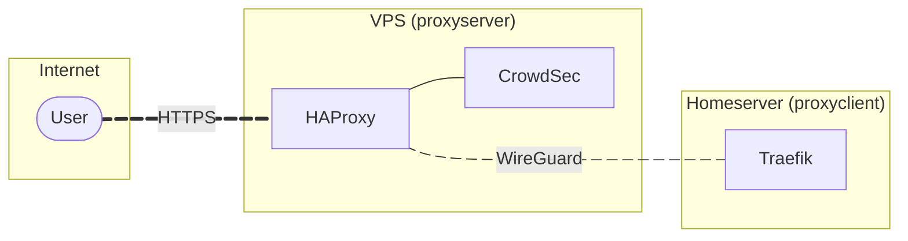

# VPS Proxy

It is critical to consider the security of exposing services to the public internet. The easiest method to expose services is simply opening ports on your router. However, this then discloses your home network's public IP address. Alternatively, you can avoid opening ports by using a VPN. This way you connect directly to the server, and traffic is tunnelled when accessing services. But this can be cumbersome and difficult for end-users to correctly utilise.

The karo-stack's solution to this issue actually involves a mix of both approaches. You'll open ports, but on a rented VPS (Virtual Private Server) instead of your home network. And your new VPS will then be directly connected to the server over a VPN.

### Proxy stack

You'll need to rent a small VPS, ideally one geographically close to you. Then after installing Debian and setting up the karo-stack on the VPS. You'll deploy the project's custom `proxy` stack.



There are three parts to the proxy stack:

- **HAProxy** - A high performance reverse proxy. Routes traffic [without needing to terminate TLS](https://www.bomberbot.com/proxy/haproxy-and-server-name-indication-sni-the-definitive-guide/) connections on the VPS. And can preserve the user's IP address using the [PROXY protocol](https://www.haproxy.com/blog/use-the-proxy-protocol-to-preserve-a-clients-ip-address).

- **CrowdSec** - A crowdsourced web application firewall. Detects and blocks malicious traffic.

- **WireGuard** - A VPN protocol. Securely tunnels traffic between the VPS and homeserver.

This page outlines the steps required to setup a VPS as a `proxyserver` with the karo-stack.

## DNS records

Your VPS will likely have a static IPv4 address, so you won't need to use a dynamic DNS service. Instead, simply create a DNS A record, with the name being your chosen `<public subdomain>`, targetting the `<public vps ipv4>`.

| Type | Name     | Target              | Comment                |
| ---- | -------- | ------------------- | ---------------------- |
| A    | `public` | `<public vps ipv4>` | `public address (vps)` |

## VPS setup

Most VPS providers will simply create a pre-configured Debian server for you. As such, if you can't self-install Debian (and use the preseed file). Then you'll need to configure your new Debian VPS manually. Creating the correct environment for the Ansible playbook to run in.

### Debian post-install

Connect via SSH as the `root` user:

```sh
ssh root@public.example.com
```

Run the following commands to replicate the preseed process:

```sh
# apply updates
apt update
apt upgrade
```

```sh
# create karo user
adduser --comment "" karo
usermod -aG sudo karo
```

```sh
# create karo directories
install -d -m 0775 -o karo -g karo /srv/karo
install -d -m 0775 -o karo -g karo /home/karo/.ssh
```

```sh
# create karo authorized_keys
install -m 0644 -o karo -g karo /root/.ssh/authorized_keys /home/karo/.ssh
```

```sh
# install packages
apt -y install chrony openssh-server ansible acl python3-debian \
    just parted rsync micro git curl wget btop tree man-db
```

```sh
# finish manual setup
exit
```

### Ansible vault 

!!! info "Continuing setup on your homeserver"

    From this point onwards, setup of the VPS should be handled via Ansible on your homeserver.

Connect via SSH to your **homeserver**:

```sh
ssh -A karo@int.example.com
```

Generate a new unique password (save inside your password manager):

```sh
openssl rand -hex 48
```

Set the new password for Ansible to use:

```sh
just setup-password
```

Create and edit a new vault named `proxyserver`:

```sh
just setup-vault proxyserver
```

```yaml
# proxyserver
#
# CONFIDENTIAL

---

# karo-git

karo_git_user_email: git@example.com
karo_git_user_name: username
karo_git_user_signingkey: "ssh-ed25519 AAAAC3NqnC1bZEIl2..."

# karo-nftables

# ports 80 (tcp) and 443 (tcp/udp) are already accepted
# karo_nftables_accepted_tcp_ports: "" # e.g. "53, 465, 587"
# karo_nftables_accepted_udp_ports: "" # e.g. "7777, 25565"

# karo-ssh

# this port will be accepted in nftables
karo_ssh_port: 4444

# karo-compose

karo_compose_root_domain: example.com

karo_compose_timezone: "Europe/London" # utctime.info/timezone

# traefik

karo_compose_traefik_enabled: false

# pocketid

karo_compose_pocketid_enabled: false

```

### Ansible playbook

Update your inventory's `hosts.ini` file to include the VPS as a new host:

```sh
micro /srv/karo/inventory/hosts.ini
```

```ini title="/srv/karo/inventory/hosts.ini"
[server]
homeserver ansible_host=localhost ansible_connection=local ansible_user=karo
proxyserver ansible_host=public.example.com ansible_port=22 ansible_connection=ssh ansible_user=karo
```

Configure the VPS:

```sh
just setup-server proxyserver
```

Adjust your `hosts.ini` file to use the new SSH port:

```sh
micro /srv/karo/inventory/hosts.ini
```

``` { .ini .no-copy }
ansible_port=4444
```

Deploy the proxy stack:

```sh
just setup-compose proxyserver -s proxy
```

### Git changes

Commit your changes:

```sh
cd /srv/karo/inventory

git add *
git commit -m "update inventory files"
git push
```

## Server proxy setup

You'll also need to run the proxy stack on your server. Which will simply run an instance of Gluetun to tunnel traffic from your VPS.

The stack should be run as a client on your server. You can see details about the stack's setup on its [dedicated page](../../stacks/extra/proxy/).
