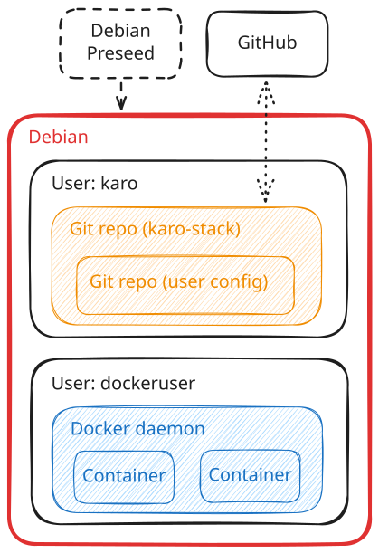

# Introduction

At its core, the karo-stack is primarily an Ansible playbook,
intended to run on a Debian Linux operating system.
Although before Ansible is used, the project also helps with automating the Debian install process,
by way of a Debian preseed file.
This initial process configures recommended packages and host settings for you,
quickly creating a freshly optimised environment, which is almost immediately ready for use.

Git is used to manage both the karo-stack and the user's own configuration with version control.
Then Ansible is run on demand to further configure the system for you.
Part of which, is the fully automatically setup of Docker.

After setup is complete, users can then start to easily deploy custom Docker compose stacks.
Done completely through Ansible, and based on the user's personal configuration

/// caption
Debian host layout
///

!!! abstract "Rootless Docker"

    An important distinction compared to most self-hosted setups,
    is that the karo-stack configures the Docker daemon to run as rootless.
    Living under a separate non‑privileged user.

    By default, the Docker daemon would normally run as root.
    But this is considered a bad practice when running third party containers.
    As while it is unlikely, a malicious container could potentially exploit a privilege escalation vulnerability,
    and take control of parts of the host system.

    Running Docker rootless is just one example of where the karo-stack has tried to consider security and the principle of least privilege.
    It's also why you won't see a karo-stack ISO file to download either.
    As it's much safer for users to download a trusted and well-maintained Debian ISO file directly from Debian.org.
    Then apply the karo-stack's configuration via the preseed file and playbook themselves, with code that's easily auditable.

*[Ansible playbook]: Playbooks are automation blueprints written in YAML, that Ansible uses to configure your target system.
*[Debian preseed]: Custom preconfiguration file, that automatically provides answers to questions asked during Debian's installation process.
